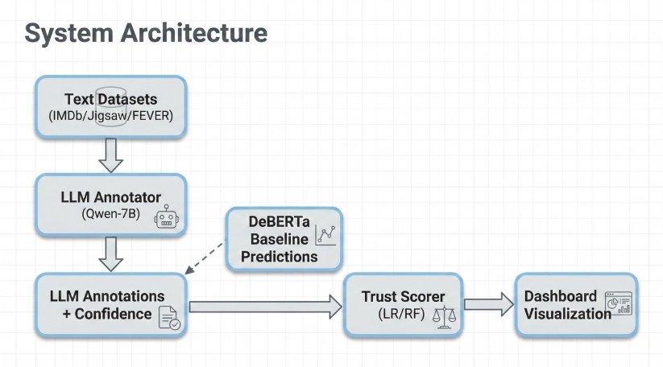
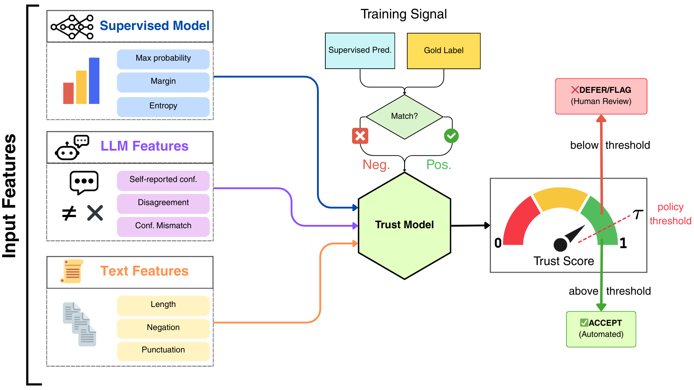
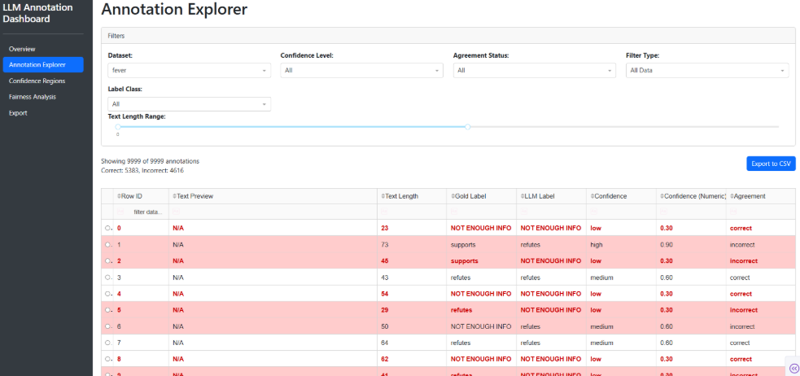
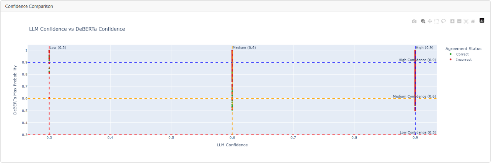
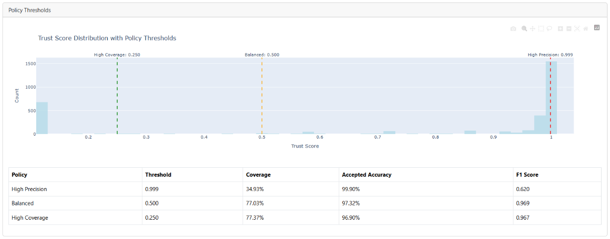
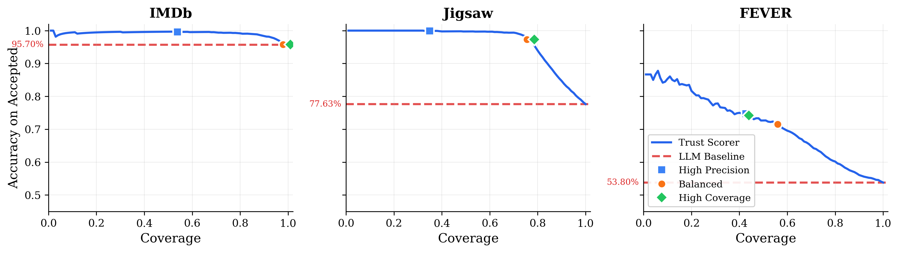

# Confidence-Aware Annotation with LLMs  
*A framework for reliable, auditable, semi-automated dataset labeling*

Use agreement, disagreement, and calibrated trust scoring to decide when LLM annotations are safe to keep and when humans should intervene.  

---

# Contents

- [Overview](#overview)
- [System Architecture](#system-architecture)
- [Key Features](#key-features)
- [Trust Scorer](#trust-scorer)
- [Dashboard](#dashboard)
- [Results](#results)
- [Datasets](#datasets)
- [Installation](#installation)
- [Usage](#usage)
---

# Overview

Modern LLMs are powerful annotators, yet they remain:

- overconfident  
- inconsistent  
- mismatched with supervised baselines  
- unreliable for sensitive tasks such as fact verification or toxicity detection

This project develops a **trust-aware annotation pipeline** that quantifies when an LLM prediction is likely correct and when it should be reviewed by a human.  
The system turns raw LLM outputs into **calibrated, actionable trust scores** and visualizes them through an interactive dashboard.

---

# System Architecture



A high-level view of the flow from LLM outputs → feature extraction → trust scoring → dashboard visualization.

---

# Key Features

### Deterministic LLM annotation  
- JSON schema enforcement  
- Low-temperature decoding  
- Automatic validation and re-querying  

### Supervised baseline for cross-model validation  
- DeBERTa-v3 fine-tuned for each dataset  
- Provides entropy, margins, and confidence features  

### Trust Scorer  
- Logistic regression + isotonic calibration  
- Uses confidence, disagreement, and text features  
- Outputs actionable trust scores for deferral policies  

### Selective annotation policies  
- High Precision  
- High Coverage  
- Balanced F1  

### Interactive dashboard  
- Confidence regions  
- Hard-case explorer  
- Threshold tuning  
- Dataset-level summaries  

---

## Trust Scorer



Feature groups include:

- LLM confidence  
- baseline probabilities  
- cross-model disagreement  
- text-level complexity indicators  

The scorer outputs a calibrated trust score  
`P(correct annotation | features)`  
used to determine whether to **automate** or **defer**.

---

# Dashboard

  
  


The dashboard provides:

### **1. Overview Metrics**  
Summaries of accuracy, κ, F1, ECE, and class-level behavior.

### **2. Annotation Explorer**  
Interactive filtering of examples by confidence, agreement, difficulty, and correctness.

### **3. Confidence Regions + Policy Analysis**  
Scatterplots, threshold sliders, and coverage/accuracy tradeoff curves.

---

# Results



Selective annotation highlights:

- IMDb: nearly full automation with minimal accuracy loss  
- Jigsaw: 97.3 percent accepted accuracy at 77 percent coverage  
- FEVER: trust scoring substantially improves acceptance precision  

<table>
  <thead>
    <tr>
      <th>Dataset</th>
      <th>ROC-AUC</th>
      <th>ECE</th>
      <th>Accepted Accuracy</th>
      <th>Coverage</th>
    </tr>
  </thead>
  <tbody>
    <tr>
      <td>IMDb</td>
      <td>0.894</td>
      <td>0.006</td>
      <td>95.7%</td>
      <td>99.4%</td>
    </tr>
    <tr>
      <td>Jigsaw</td>
      <td>0.974</td>
      <td>0.003</td>
      <td>97.3%</td>
      <td>77.0%</td>
    </tr>
    <tr>
      <td>FEVER</td>
      <td>0.736</td>
      <td>0.040</td>
      <td>71.5%</td>
      <td>55.9%</td>
    </tr>
  </tbody>
</table>

For detailed metrics, predictions, plots, and ablation studies, explore the `results/` directory.

---

# Datasets

<table>
  <thead>
    <tr>
      <th>Dataset</th>
      <th>Train</th>
      <th>Dev</th>
      <th>Test</th>
      <th>Classes</th>
    </tr>
  </thead>
  <tbody>
    <tr>
      <td>IMDb</td>
      <td>25000</td>
      <td>12500</td>
      <td>12500</td>
      <td>2</td>
    </tr>
    <tr>
      <td>Jigsaw</td>
      <td>1.8M</td>
      <td>97320</td>
      <td>97320</td>
      <td>2</td>
    </tr>
    <tr>
      <td>FEVER</td>
      <td>145449</td>
      <td>9999</td>
      <td>9999</td>
      <td>3</td>
    </tr>
  </tbody>
</table>

For dataset structure, statistics, label mappings, and download information, see `data/README.md`.

---

# Installation

```
git clone https://github.com/Metrossa/1684Proj
pip install -r requirements.txt
```

---

# Usage

### Launch dashboard
```
python dashboard/app.py
```

### Generate LLM annotations
```
python scripts/run_llm_annotations.py
```

### Train the baseline model
```
python scripts/train_baseline_models.py
```

### Train trust scorer
```
python scripts/train_trust_scorer.py
```
